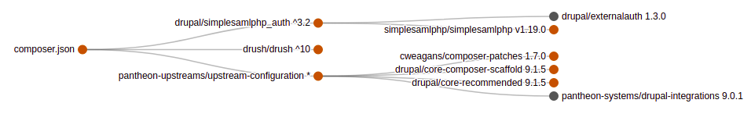

# Composer dependency tree visualization
This is a simple PHP library that will take a standard ``composer.json`` file and ``composer.lock`` file and generate a dependency tree, using the [D3JS](https://d3js.org/) visualization known as the [collapsible tree](https://observablehq.com/@d3/collapsible-tree).



Full demo at https://dependency.markfullmer.com

## Basic usage

1. Require this library to your PHP project:

```
composer require markfullmer/dependency_tree
```

2. Ensure the library is autoloaded in your PHP file:

```php
use markfullmer\DependencyTree;
```

3. Copy or reference the `d3.dependencyTree.js` file from this library into your project and load it into a web page, along with the underlying [D3JS](https://d3js.org/) API library.

```html
<script src='https://d3js.org/d3.v4.min.js'></script>
<script src='./js/d3.dependencyTree.js'></script>
```

3. Supply the contents of `composer.json` and `composer.lock` files as arguments and generate the tree. (Change the third parameter to `TRUE` to print version information.)

```php
  $data = DependencyTree::generateTree($root, $lock, FALSE);
```

4. Render the resulting data via Javascript, supplying the data and an HTML target ID.

```php
  echo '
    <script>
      dependencyTree('. $data .');
    </script>
  ';
```
